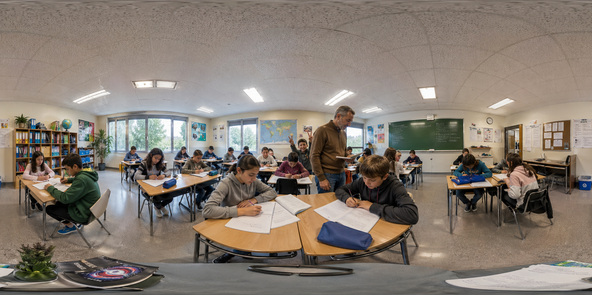

# Visor 360°

Visor de imágenes equirectangulares (360°) en el navegador, sin instalación ni servidor.

**Demo:** https://jjdeharo.github.io/visor_360/

## Uso

Abre `index.html` en el navegador o visita la demo online.

Al iniciar carga automáticamente `ejemplo.png` como imagen de muestra. Puedes cargar cualquier imagen equirectangular propia con el botón **Abrir imagen** o arrastrando el archivo a la ventana.

## Controles

| Acción | Ratón | Táctil |
|---|---|---|
| Girar cámara | Arrastrar | Arrastrar con 1 dedo |
| Zoom | Rueda del ratón | Pellizcar con 2 dedos |
| Zoom rápido | Botones +/− | Botones +/− |
| Autorrotación | Botón ↺ | Botón ↺ |

## Formato de imagen

La imagen debe estar en formato **equirectangular** (proporción 2:1), el estándar de las cámaras 360° como GoPro MAX, Ricoh Theta, Insta360, etc.

## Tecnología

- [Three.js](https://threejs.org/) vía CDN (importmap)
- HTML + CSS + JS puro — sin frameworks ni build step
